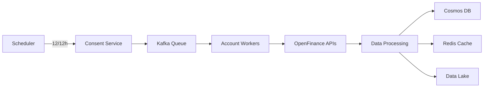

# Sistema Open Finance Brasil - High Performance

## 📋 Visão Geral

Sistema de alta performance para consumo e processamento de dados do Open Finance Brasil, desenvolvido com Java 21 e Spring Boot 3.5.3, capaz de processar dados de **1 milhão de clientes** com **5 contas cada**, totalizando **10 milhões de operações diárias**.

### 🎯 Características Principais

- **Arquitetura de Microserviços** com Spring Boot 3.5.3
- **Java 21** com Virtual Threads para máxima concorrência
- **Azure Cosmos DB** para escalabilidade global
- **Redis Cluster** para cache distribuído
- **Apache Kafka** para processamento assíncrono
- **Kubernetes** com auto-scaling (HPA + KEDA)
- **Arquitetura Hexagonal** e princípios SOLID
- **OpenAPI Generator** para geração automática de modelos

## 🏗️ Arquitetura

### Componentes Principais

1. **Core Library**: Biblioteca compartilhada com funcionalidades comuns
2. **Microserviços por Produto**:
   - Accounts Service
   - Resources Service
   - Consents Service
   - (Extensível para outros produtos)
3. **Data Layer**: Azure Cosmos DB + Redis Cache
4. **Event Streaming**: Apache Kafka
5. **API Gateway**: Spring Cloud Gateway

### Fluxo de Dados



## 🚀 Performance e Escalabilidade

### Métricas de Design

- **Volume**: 1M clientes × 5 contas = 5M contas
- **Throughput**: 10M operações/dia (116 ops/s média, 1000 ops/s pico)
- **Latência**: P99 < 500ms
- **Disponibilidade**: 99.9%
- **Paralelismo**: 100-1000 workers virtuais

### Estratégias de Otimização

1. **Virtual Threads (Java 21)**: Maximiza concorrência sem overhead
2. **Particionamento Inteligente**: Distribuição uniforme no Cosmos DB
3. **Cache Multinível**: Redis com TTL de 13 horas
4. **Batch Processing**: Agregação de requests para eficiência
5. **Circuit Breakers**: Resiliência em falhas de APIs externas

## 🛠️ Tecnologias

### Core
- Java 21 (Virtual Threads)
- Spring Boot 3.5.3
- Spring WebFlux (Reactive)
- Project Reactor

### Dados
- Azure Cosmos DB (Principal)
- Redis Cluster (Cache)
- Apache Kafka (Eventos)

### Infraestrutura
- Kubernetes
- Docker
- Terraform
- Prometheus + Grafana

### Segurança
- OAuth 2.0 (Client Credentials)
- mTLS
- HashiCorp Vault

## 📦 Estrutura do Projeto

```
openfinance-system/
├── openfinance-core/              # Biblioteca core compartilhada
│   ├── src/main/java/
│   │   ├── client/               # Clientes HTTP base
│   │   ├── config/               # Configurações comuns
│   │   ├── security/             # OAuth2, mTLS
│   │   ├── metrics/              # Métricas e monitoramento
│   │   └── processor/            # Processamento paralelo
│   └── pom.xml
│
├── openfinance-accounts-service/  # Microserviço de contas
│   ├── src/main/java/
│   │   ├── domain/               # Camada de domínio (Hexagonal)
│   │   │   ├── entity/          # Entidades de negócio
│   │   │   ├── port/            # Interfaces (ports)
│   │   │   └── usecase/         # Casos de uso
│   │   ├── application/         # Camada de aplicação
│   │   │   ├── scheduler/       # Jobs agendados
│   │   │   └── service/         # Orquestradores
│   │   └── infrastructure/      # Camada de infraestrutura
│   │       ├── adapter/         # Adaptadores externos
│   │       ├── repository/      # Implementações de repositório
│   │       └── mapper/          # Mapeadores de dados
│   ├── src/main/resources/
│   │   ├── openapi/             # Especificações OpenAPI
│   │   └── application.yml      # Configurações
│   └── pom.xml
│
├── kubernetes/                    # Manifests K8s
├── terraform/                     # IaC para Azure
├── docker/                        # Dockerfiles
└── docs/                         # Documentação adicional
```

## 🔧 Configuração e Instalação

### Pré-requisitos

- Java 21+
- Maven 3.8+
- Docker & Docker Compose
- Kubernetes cluster (AKS recomendado)
- Azure CLI

### Build Local

```bash
# Clone o repositório
git clone https://github.com/empresa/openfinance-system.git
cd openfinance-system

# Build da core library
cd openfinance-core
mvn clean install

# Build do serviço de accounts
cd ../openfinance-accounts-service
mvn clean package

# Executar com Docker Compose (desenvolvimento)
docker-compose up -d
```

### Deploy em Kubernetes

```bash
# Criar namespace
kubectl create namespace openfinance

# Aplicar secrets
kubectl apply -f kubernetes/secrets.yaml

# Deploy do Redis Cluster
kubectl apply -f kubernetes/redis-cluster.yaml

# Deploy do serviço
kubectl apply -f kubernetes/accounts-service-deployment.yaml

# Configurar auto-scaling com KEDA
kubectl apply -f kubernetes/keda-scaledobject.yaml
```

### Configuração do Azure Cosmos DB

```bash
# Via Terraform
cd terraform
terraform init
terraform plan -var="environment=prod"
terraform apply -var="environment=prod"

# Ou via Azure CLI
az cosmosdb create \
  --name openfinance-cosmos-prod \
  --resource-group openfinance-rg \
  --kind GlobalDocumentDB \
  --locations regionName=brazilsouth failoverPriority=0 \
  --locations regionName=eastus failoverPriority=1 \
  --enable-multiple-write-locations true \
  --enable-automatic-failover true
```

## 📊 Monitoramento

### Métricas Principais

- **API Calls**: Latência, throughput, taxa de erro
- **Processing**: Contas processadas, tempo de batch
- **Infrastructure**: CPU, memória, I/O
- **Business**: SLA compliance, data freshness

### Dashboards Grafana

1. **Overview Dashboard**: Métricas gerais do sistema
2. **API Performance**: Latência por instituição/endpoint
3. **Processing Pipeline**: Status do processamento batch
4. **Infrastructure**: Recursos e auto-scaling

### Alertas Configurados

- Taxa de erro > 1%
- Latência P99 > 1s
- Lag do Kafka > 10k mensagens
- CPU/Memória > 80%

## 🔐 Segurança

### Autenticação e Autorização

- OAuth 2.0 com Client Credentials Flow
- mTLS para comunicação entre serviços
- Tokens com TTL curto e refresh automático

### Gestão de Secrets

```yaml
# Vault integration
vault:
  uri: https://vault.empresa.com
  authentication: KUBERNETES
  kubernetes:
    role: openfinance-accounts
    service-account-name: accounts-service
```

### Compliance

- Dados criptografados em repouso e trânsito
- Audit logs para todas operações
- LGPD compliance com data retention policies

## 🧪 Testes

### Testes de Carga

```bash
# Executar testes de carga com K6
k6 run --vus 1000 --duration 30m tests/load/accounts-update.js

# Resultados esperados:
# - 1000+ req/s sustained
# - P99 latency < 500ms
# - 0% error rate
```

### Testes de Resiliência

- Chaos Engineering com Chaos Mesh
- Simulação de falhas de rede
- Testes de circuit breaker
- Recovery time objectives (RTO)

## 📈 Roadmap

### Fase 1 - MVP (Current)
- ✅ Core Library
- ✅ Accounts Service
- ✅ Processamento batch 2x/dia
- ✅ Cache e resiliência

### Fase 2 - Expansão
- [ ] Resources Service
- [ ] Consents Service
- [ ] Real-time updates via webhooks
- [ ] Multi-tenant support

### Fase 3 - Advanced Features
- [ ] ML pipeline integration
- [ ] Predictive scaling
- [ ] GraphQL API
- [ ] Event sourcing completo

## 🤝 Contribuindo

1. Fork o projeto
2. Crie uma feature branch (`git checkout -b feature/AmazingFeature`)
3. Commit suas mudanças (`git commit -m 'Add some AmazingFeature'`)
4. Push para a branch (`git push origin feature/AmazingFeature`)
5. Abra um Pull Request

### Padrões de Código

- Checkstyle configuration em `checkstyle.xml`
- SonarQube quality gates
- Cobertura mínima de testes: 80%
- Code reviews obrigatórios

## 📝 Licença

Proprietário - Todos os direitos reservados.

## 📞 Suporte

- **Email**: openfinance-team@empresa.com
- **Slack**: #openfinance-support
- **Wiki**: https://wiki.empresa.com/openfinance

## 🔗 Links Úteis

- [Documentação Open Finance Brasil](https://openfinancebrasil.org.br)
- [Spring Boot 3.5 Docs](https://spring.io/projects/spring-boot)
- [Azure Cosmos DB Docs](https://docs.microsoft.com/en-us/azure/cosmos-db/)
- [Project Loom (Virtual Threads)](https://openjdk.org/projects/loom/)