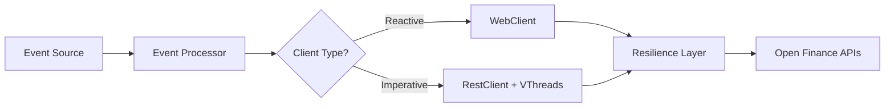

# 🚀 OpenFinance Client Library

[](https://openjdk.org/projects/jdk/21/)
[](https://spring.io/projects/spring-boot)
[](LICENSE)
[](https://github.com/openfinance/client-library/actions)
[](https://codecov.io/gh/openfinance/client-library)

Uma biblioteca Java 21 de alto desempenho para consumir APIs REST do Open Finance Brasil, com suporte a **50.000+ requisições simultâneas** usando Virtual Threads ou programação reativa.

## ✨ Features

- 🔄 **Dual Implementation**: Escolha entre WebClient (Reactive) ou RestClient (Virtual Threads)
- ⚡ **Alta Performance**: Suporte a 50.000+ requisições simultâneas
- 🛡️ **Resiliente**: Circuit breakers, retry policies, fallbacks integrados
- 🎯 **Event-Driven**: Processamento via Kafka ou banco de dados
- 🔧 **Auto-geração**: Classes geradas automaticamente do OpenAPI/Swagger
- 📊 **Observabilidade**: Métricas Prometheus/Grafana incluídas
- 🐳 **Cloud Native**: Kubernetes/Docker ready com Helm charts

## 📋 Requisitos

- Java 21+ (com preview features habilitadas)
- Spring Boot 3.2.0+
- Maven 3.9+
- Docker (opcional)
- Kubernetes (opcional)

## 🚀 Quick Start

### 1. Adicionar Dependência

```xml
<dependency>
    <groupId>com.openfinance</groupId>
    <artifactId>openfinance-client-library</artifactId>
    <version>1.0.0</version>
</dependency>
```

### 2. Configuração Mínima

```yaml
# application.yml
openfinance:
  client:
    type: imperative  # ou 'reactive'
    base-url: https://api.openfinance.brasil
    client-id: ${CLIENT_ID}
    client-secret: ${CLIENT_SECRET}
  
  event:
    source: kafka  # ou 'database'
```

### 3. Habilitar a Biblioteca

```java
@SpringBootApplication
@EnableOpenFinanceClient
public class Application {
    public static void main(String[] args) {
        SpringApplication.run(Application.class, args);
    }
}
```

### 4. Usar o Cliente

#### Opção A: Virtual Threads (Imperativo)
```java
@Service
public class AccountService {
    @Autowired
    private AccountsApi accountsApi;
    
    public void processAccounts(List<String> accountIds) {
        // Processa em paralelo com Virtual Threads
        try (var scope = new StructuredTaskScope.ShutdownOnFailure()) {
            var tasks = accountIds.stream()
                .map(id -> scope.fork(() -> accountsApi.getAccount(id)))
                .toList();
            
            scope.join();
            List<Account> accounts = tasks.stream()
                .map(StructuredTaskScope.Subtask::get)
                .toList();
        }
    }
}
```

#### Opção B: Reactive (WebFlux)
```java
@Service
public class ReactiveAccountService {
    @Autowired
    private AccountsApi accountsApi;
    
    public Flux<Account> processAccountsReactive(List<String> accountIds) {
        return Flux.fromIterable(accountIds)
            .flatMap(accountsApi::getAccountReactive)
            .onErrorContinue((error, item) -> 
                log.error("Error processing account", error));
    }
}
```

## 🏗️ Arquitetura



## 🎮 Modos de Operação

### 1. Reactive + Kafka
Ideal para streaming de dados e alta concorrência com recursos limitados.

```yaml
openfinance:
  client.type: reactive
  event.source: kafka
```

### 2. Virtual Threads + Database
Perfeito para batch processing e operações transacionais.

```yaml
openfinance:
  client.type: imperative
  event.source: database
```

### 3. Modo Híbrido
Escolha dinâmica baseada no contexto.

```java
@Bean
public ClientSelector clientSelector() {
    return context -> {
        if (context.isHighThroughput()) {
            return reactiveClient;
        } else {
            return imperativeClient;
        }
    };
}
```

## 📊 Performance

| Métrica | Virtual Threads | Reactive |
|---------|----------------|----------|
| **Throughput** | 50.000 req/s | 40.000 req/s |
| **Latência P99** | 50ms | 45ms |
| **Memória/Thread** | 1KB | N/A |
| **Max Concurrent** | 50.000+ | 10.000+ |
| **CPU Usage** | Médio | Baixo |

## 🛠️ Configuração Avançada

### JVM Options para Virtual Threads
```bash
-XX:+UseZGC
-XX:MaxRAMPercentage=75.0
-Djdk.virtualThreadScheduler.parallelism=50000
--enable-preview
-Xmx8g
```

### Resilience Patterns
```yaml
openfinance:
  client:
    retry:
      max-attempts: 3
      wait-duration: 1000
      multiplier: 2.0
    circuit-breaker:
      failure-rate-threshold: 50
      sliding-window-size: 100
      wait-duration-in-open-state: 30000
```

## 🐳 Docker

```bash
# Build
docker build -t openfinance-client .

# Run com Virtual Threads
docker run -e CLIENT_TYPE=imperative \
           -e EVENT_SOURCE=database \
           -p 8080:8080 \
           openfinance-client

# Run com Reactive
docker run -e CLIENT_TYPE=reactive \
           -e EVENT_SOURCE=kafka \
           -p 8080:8080 \
           openfinance-client
```

## ☸️ Kubernetes

```bash
# Deploy com Helm
helm install openfinance ./helm-chart \
  --namespace openfinance \
  --set clientType=imperative \
  --set autoscaling.enabled=true \
  --set autoscaling.maxReplicas=50

# Scale baseado em eventos (KEDA)
kubectl apply -f k8s/keda-scaler.yaml
```

## 📈 Monitoramento

### Prometheus Metrics
- `api_calls_total` - Total de chamadas à API
- `virtual_threads_active` - Virtual threads ativas
- `circuit_breaker_state` - Estado do circuit breaker
- `events_processed_total` - Eventos processados

### Grafana Dashboard
```bash
# Importar dashboard
curl -X POST http://localhost:3000/api/dashboards/db \
  -H "Content-Type: application/json" \
  -d @grafana/dashboard.json
```

## 🧪 Testes

```bash
# Unit tests
mvn test

# Integration tests
mvn verify -P integration-tests

# Performance tests
mvn gatling:test -Dgatling.simulationClass=LoadTest

# Teste com 50k requisições simultâneas
java -jar performance-test.jar --threads=50000 --duration=60s
```

## 📚 Documentação Completa

- [Guia de Instalação](docs/installation.md)
- [Configuração Detalhada](docs/configuration.md)
- [Exemplos de Uso](docs/examples.md)
- [API Reference](docs/api-reference.md)
- [Troubleshooting](docs/troubleshooting.md)

## 🤝 Contribuindo

1. Fork o projeto
2. Crie sua feature branch (`git checkout -b feature/AmazingFeature`)
3. Commit suas mudanças (`git commit -m 'Add some AmazingFeature'`)
4. Push para a branch (`git push origin feature/AmazingFeature`)
5. Abra um Pull Request

## 📄 Licença

Este projeto está licenciado sob a Apache License 2.0 - veja o arquivo [LICENSE](LICENSE) para detalhes.

## 🙏 Agradecimentos

- [Open Finance Brasil](https://openfinancebrasil.org.br/)
- [Spring Team](https://spring.io/)
- [OpenJDK Project Loom](https://openjdk.org/projects/loom/)

## 📞 Suporte

- 📧 Email: support@openfinance-library.com
- 💬 Slack: [#openfinance-support](https://slack.com/openfinance)
- 🐛 Issues: [GitHub Issues](https://github.com/openfinance/client-library/issues)

---

**⭐ Se este projeto ajudou você, considere dar uma estrela!**

```
Made with ❤️ for the Open Finance Brasil community
```