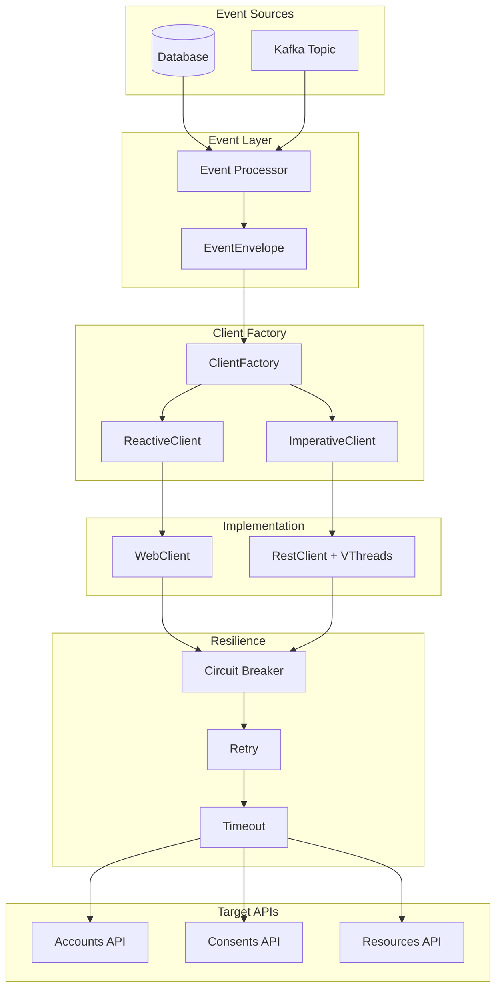

# 🚀 OpenFinance Client Library - Documentação Completa

## 📋 Índice

1. [Visão Geral](#visão-geral)
2. [Arquitetura da Biblioteca](#arquitetura-da-biblioteca)
3. [Configuração OpenAPI Generator](#configuração-openapi-generator)
4. [Implementação dos Clientes REST](#implementação-dos-clientes-rest)
5. [Sistema de Eventos](#sistema-de-eventos)
6. [Resiliência e Tolerância a Falhas](#resiliência-e-tolerância-a-falhas)
7. [Configuração e Performance](#configuração-e-performance)
8. [Guia de Uso](#guia-de-uso)
9. [Exemplos Práticos](#exemplos-práticos)
10. [Monitoramento e Métricas](#monitoramento-e-métricas)

---

## 1. Visão Geral

### 1.1 Objetivo

A **OpenFinance Client Library** é uma biblioteca Java 21 de alto desempenho para consumir APIs REST seguindo especificações OpenAPI/Swagger, oferecendo:

- ✅ **Duas implementações**: Reativa (WebClient) e Imperativa (RestClient + Virtual Threads)
- ✅ **Alta escalabilidade**: Suporte a 50.000 requisições simultâneas
- ✅ **Tolerância a falhas**: Circuit breakers, retry policies, fallbacks
- ✅ **Fontes de eventos flexíveis**: Banco de dados ou Kafka
- ✅ **Geração automática**: Classes e interfaces a partir de OpenAPI YAML

### 1.2 Features Principais

| Feature | Descrição |
|---------|-----------|
| **Dual Implementation** | Escolha entre programação reativa ou imperativa |
| **Virtual Threads** | Suporte nativo ao Java 21 para alta concorrência |
| **Event-Driven** | Processamento baseado em eventos de DB ou Kafka |
| **Resilience** | Circuit breakers, retry, timeout, bulkhead |
| **Auto-generation** | Código gerado automaticamente via OpenAPI |
| **High Performance** | Otimizado para 50k+ requests simultâneos |

---

## 2. Arquitetura da Biblioteca

### 2.1 Estrutura do Projeto

```
openfinance-client-library/
├── openfinance-core/                    # Core da biblioteca
│   ├── src/main/java/
│   │   ├── config/                     # Configurações Spring
│   │   ├── client/                     # Interfaces dos clientes
│   │   │   ├── reactive/               # Implementação WebClient
│   │   │   └── imperative/             # Implementação RestClient
│   │   ├── event/                      # Sistema de eventos
│   │   │   ├── model/                  # EventEnvelope
│   │   │   ├── source/                 # Fontes de eventos
│   │   │   │   ├── database/           # Consumidor DB
│   │   │   │   └── kafka/              # Consumidor Kafka
│   │   │   └── processor/              # Processadores
│   │   ├── resilience/                 # Tolerância a falhas
│   │   └── metrics/                    # Métricas e monitoramento
│   └── src/main/resources/
│       └── META-INF/
│           └── spring.factories        # Auto-configuração
│
├── openfinance-generator/              # Módulo de geração
│   ├── src/main/resources/
│   │   └── templates/                  # Templates customizados
│   └── pom.xml                        # Config OpenAPI Generator
│
├── openfinance-samples/                # Exemplos de uso
│   ├── reactive-kafka-sample/
│   ├── imperative-db-sample/
│   └── hybrid-sample/
│
└── pom.xml                            # POM principal
```

### 2.2 Diagrama de Arquitetura



---

## 3. Configuração OpenAPI Generator

### 3.1 Maven Plugin Configuration

```xml
<!-- pom.xml do módulo openfinance-generator -->
<plugin>
    <groupId>org.openapitools</groupId>
    <artifactId>openapi-generator-maven-plugin</artifactId>
    <version>7.2.0</version>
    <executions>
        <execution>
            <id>generate-api-client</id>
            <goals>
                <goal>generate</goal>
            </goals>
            <configuration>
                <inputSpec>${project.basedir}/src/main/resources/openapi/accounts-api.yaml</inputSpec>
                <generatorName>java</generatorName>
                <library>native</library> <!-- Para Java 11+ HttpClient -->
                <output>${project.build.directory}/generated-sources</output>
                
                <configOptions>
                    <sourceFolder>src/main/java</sourceFolder>
                    <dateLibrary>java8</dateLibrary>
                    <java8>false</java8>
                    <useJakartaEe>true</useJakartaEe>
                    <interfaceOnly>true</interfaceOnly>
                    <skipDefaultInterface>true</skipDefaultInterface>
                    <useBeanValidation>true</useBeanValidation>
                    <performBeanValidation>true</performBeanValidation>
                    <useOptional>true</useOptional>
                    <documentationProvider>springdoc</documentationProvider>
                    <annotationLibrary>swagger2</annotationLibrary>
                    <virtualThreads>true</virtualThreads>
                </configOptions>
                
                <generateApiTests>false</generateApiTests>
                <generateModelTests>false</generateModelTests>
                <generateApiDocumentation>true</generateApiDocumentation>
                <generateModelDocumentation>true</generateModelDocumentation>
                
                <typeMappings>
                    <typeMapping>OffsetDateTime=java.time.Instant</typeMapping>
                    <typeMapping>UUID=java.util.UUID</typeMapping>
                </typeMappings>
                
                <importMappings>
                    <importMapping>java.time.OffsetDateTime=java.time.Instant</importMapping>
                </importMappings>
                
                <templateDirectory>${project.basedir}/src/main/resources/templates</templateDirectory>
            </configuration>
        </execution>
    </executions>
</plugin>
```

### 3.2 Template Customizado para Interfaces

```java
// templates/api.mustache
package {{package}};

{{#imports}}import {{import}};
{{/imports}}

import reactor.core.publisher.Mono;
import reactor.core.publisher.Flux;
import java.util.concurrent.CompletableFuture;

{{#operations}}
/**
 * {{classname}} - Generated API Interface
 * {{description}}
 */
public interface {{classname}} {
    
    {{#operation}}
    /**
     * {{summary}}
     * {{notes}}
     {{#allParams}}
     * @param {{paramName}} {{description}}
     {{/allParams}}
     * @return {{#returnType}}{{{returnType}}}{{/returnType}}
     */
    // Reactive version
    {{#returnContainer}}
    Flux<{{#returnType}}{{{returnType}}}{{/returnType}}> {{operationId}}Reactive(
    {{/returnContainer}}
    {{^returnContainer}}
    Mono<{{#returnType}}{{{returnType}}}{{/returnType}}> {{operationId}}Reactive(
    {{/returnContainer}}
        {{#allParams}}{{dataType}} {{paramName}}{{^-last}}, {{/-last}}{{/allParams}}
    );
    
    // Imperative version with Virtual Threads
    CompletableFuture<{{#returnType}}{{{returnType}}}{{/returnType}}> {{operationId}}Async(
        {{#allParams}}{{dataType}} {{paramName}}{{^-last}}, {{/-last}}{{/allParams}}
    );
    
    // Blocking version
    {{#returnType}}{{{returnType}}}{{/returnType}} {{operationId}}(
        {{#allParams}}{{dataType}} {{paramName}}{{^-last}}, {{/-last}}{{/allParams}}
    );
    {{/operation}}
}
{{/operations}}
```

---

## 4. Implementação dos Clientes REST

### 4.1 Cliente Reativo (WebClient)

```java
package com.openfinance.client.reactive;

import org.springframework.web.reactive.function.client.WebClient;
import reactor.core.publisher.Mono;
import reactor.util.retry.Retry;
import io.github.resilience4j.circuitbreaker.CircuitBreaker;
import io.github.resilience4j.reactor.circuitbreaker.operator.CircuitBreakerOperator;

@Component
@ConditionalOnProperty(name = "openfinance.client.type", havingValue = "reactive")
public class ReactiveApiClient implements AccountsApi {
    
    private final WebClient webClient;
    private final CircuitBreaker circuitBreaker;
    private final ClientConfiguration config;
    
    public ReactiveApiClient(WebClient.Builder webClientBuilder, 
                            CircuitBreaker circuitBreaker,
                            ClientConfiguration config) {
        this.circuitBreaker = circuitBreaker;
        this.config = config;
        
        this.webClient = webClientBuilder
            .baseUrl(config.getBaseUrl())
            .defaultHeaders(headers -> {
                headers.setBearerAuth(config.getAccessToken());
                headers.set("x-fapi-interaction-id", UUID.randomUUID().toString());
            })
            .codecs(configurer -> {
                configurer.defaultCodecs().maxInMemorySize(10 * 1024 * 1024); // 10MB
            })
            .build();
    }
    
    @Override
    public Mono<Account> getAccountReactive(String accountId) {
        return webClient
            .get()
            .uri("/accounts/v3/accounts/{id}", accountId)
            .retrieve()
            .bodyToMono(Account.class)
            .timeout(Duration.ofSeconds(config.getTimeout()))
            .retryWhen(Retry.backoff(3, Duration.ofSeconds(1))
                .maxBackoff(Duration.ofSeconds(10))
                .jitter(0.5)
                .filter(throwable -> throwable instanceof WebClientRequestException))
            .transformDeferred(CircuitBreakerOperator.of(circuitBreaker))
            .doOnError(error -> log.error("Error fetching account {}: {}", 
                accountId, error.getMessage()))
            .onErrorResume(error -> {
                log.warn("Fallback activated for account {}", accountId);
                return Mono.just(Account.builder()
                    .accountId(accountId)
                    .status("UNAVAILABLE")
                    .build());
            });
    }
    
    @Override
    public Flux<Transaction> getTransactionsReactive(String accountId, 
                                                     int page, 
                                                     int pageSize) {
        return webClient
            .get()
            .uri(uriBuilder -> uriBuilder
                .path("/accounts/v3/accounts/{id}/transactions")
                .queryParam("page", page)
                .queryParam("page-size", pageSize)
                .build(accountId))
            .retrieve()
            .bodyToFlux(Transaction.class)
            .timeout(Duration.ofSeconds(config.getTimeout()))
            .limitRate(100) // Backpressure control
            .onBackpressureBuffer(1000)
            .transformDeferred(CircuitBreakerOperator.of(circuitBreaker));
    }
}
```

### 4.2 Cliente Imperativo com Virtual Threads

```java
package com.openfinance.client.imperative;

import org.springframework.web.client.RestClient;
import java.util.concurrent.CompletableFuture;
import java.util.concurrent.Executors;
import java.util.concurrent.StructuredTaskScope;
import io.github.resilience4j.circuitbreaker.CircuitBreaker;
import io.github.resilience4j.retry.Retry;

@Component
@ConditionalOnProperty(name = "openfinance.client.type", havingValue = "imperative")
public class ImperativeApiClient implements AccountsApi {
    
    private final RestClient restClient;
    private final CircuitBreaker circuitBreaker;
    private final Retry retry;
    private final ExecutorService virtualThreadExecutor;
    
    public ImperativeApiClient(RestClient.Builder restClientBuilder,
                              CircuitBreaker circuitBreaker,
                              Retry retry,
                              ClientConfiguration config) {
        this.circuitBreaker = circuitBreaker;
        this.retry = retry;
        
        // Virtual Thread Executor
        this.virtualThreadExecutor = Executors.newVirtualThreadPerTaskExecutor();
        
        this.restClient = restClientBuilder
            .baseUrl(config.getBaseUrl())
            .defaultHeader(HttpHeaders.AUTHORIZATION, "Bearer " + config.getAccessToken())
            .defaultHeader("x-fapi-interaction-id", UUID.randomUUID().toString())
            .requestFactory(clientHttpRequestFactory())
            .build();
    }
    
    private ClientHttpRequestFactory clientHttpRequestFactory() {
        JdkClientHttpRequestFactory factory = new JdkClientHttpRequestFactory();
        
        HttpClient httpClient = HttpClient.newBuilder()
            .version(HttpClient.Version.HTTP_2)
            .connectTimeout(Duration.ofSeconds(10))
            .executor(virtualThreadExecutor) // Use virtual threads
            .build();
            
        factory.setHttpClient(httpClient);
        factory.setReadTimeout(Duration.ofSeconds(30));
        return factory;
    }
    
    @Override
    public CompletableFuture<Account> getAccountAsync(String accountId) {
        return CompletableFuture.supplyAsync(() -> {
            Supplier<Account> supplier = () -> restClient
                .get()
                .uri("/accounts/v3/accounts/{id}", accountId)
                .retrieve()
                .body(Account.class);
            
            // Apply resilience patterns
            Supplier<Account> decoratedSupplier = Decorators
                .ofSupplier(supplier)
                .withCircuitBreaker(circuitBreaker)
                .withRetry(retry)
                .withFallback(Arrays.asList(Exception.class), 
                    e -> Account.builder()
                        .accountId(accountId)
                        .status("FALLBACK")
                        .build())
                .decorate();
            
            return decoratedSupplier.get();
        }, virtualThreadExecutor);
    }
    
    @Override
    public Account getAccount(String accountId) {
        return getAccountAsync(accountId).join();
    }
    
    // Batch processing with Structured Concurrency
    public List<Account> getAccountsBatch(List<String> accountIds) {
        try (var scope = new StructuredTaskScope.ShutdownOnFailure()) {
            List<StructuredTaskScope.Subtask<Account>> tasks = accountIds.stream()
                .map(id -> scope.fork(() -> getAccount(id)))
                .toList();
            
            scope.join();
            scope.throwIfFailed();
            
            return tasks.stream()
                .map(StructuredTaskScope.Subtask::get)
                .toList();
        } catch (Exception e) {
            throw new RuntimeException("Batch processing failed", e);
        }
    }
}
```

---

## 5. Sistema de Eventos

### 5.1 EventEnvelope Model

```java
package com.openfinance.client.event.model;

import lombok.Builder;
import lombok.Data;
import java.time.Instant;
import java.util.Map;
import java.util.UUID;

@Data
@Builder
public class EventEnvelope<T> {
    
    // Metadata
    private final UUID eventId;
    private final String eventType;
    private final String source;
    private final Instant timestamp;
    private final String correlationId;
    private final Integer version;
    
    // Payload
    private final T payload;
    
    // Context
    private final Map<String, Object> headers;
    private final String tenantId;
    private final String userId;
    
    // Processing
    private final Integer retryCount;
    private final Instant processAfter;
    private final EventPriority priority;
    
    public enum EventPriority {
        LOW(0), NORMAL(1), HIGH(2), CRITICAL(3);
        
        private final int value;
        
        EventPriority(int value) {
            this.value = value;
        }
    }
    
    // Factory methods
    public static <T> EventEnvelope<T> of(T payload) {
        return EventEnvelope.<T>builder()
            .eventId(UUID.randomUUID())
            .timestamp(Instant.now())
            .payload(payload)
            .version(1)
            .priority(EventPriority.NORMAL)
            .retryCount(0)
            .build();
    }
    
    public static <T> EventEnvelope<T> fromDatabase(EventEntity entity, T payload) {
        return EventEnvelope.<T>builder()
            .eventId(entity.getId())
            .eventType(entity.getEventType())
            .source("database")
            .timestamp(entity.getCreatedAt())
            .correlationId(entity.getCorrelationId())
            .payload(payload)
            .headers(entity.getHeaders())
            .retryCount(entity.getRetryCount())
            .processAfter(entity.getProcessAfter())
            .priority(EventPriority.valueOf(entity.getPriority()))
            .build();
    }
    
    public static <T> EventEnvelope<T> fromKafka(ConsumerRecord<String, T> record) {
        Map<String, Object> headers = StreamSupport
            .stream(record.headers().spliterator(), false)
            .collect(Collectors.toMap(
                Header::key,
                header -> new String(header.value(), StandardCharsets.UTF_8)
            ));
        
        return EventEnvelope.<T>builder()
            .eventId(UUID.fromString(headers.getOrDefault("eventId", 
                UUID.randomUUID().toString()).toString()))
            .eventType(headers.getOrDefault("eventType", "UNKNOWN").toString())
            .source("kafka")
            .timestamp(Instant.ofEpochMilli(record.timestamp()))
            .correlationId(headers.getOrDefault("correlationId", "").toString())
            .payload(record.value())
            .headers(headers)
            .priority(EventPriority.valueOf(
                headers.getOrDefault("priority", "NORMAL").toString()))
            .build();
    }
}
```

### 5.2 Database Event Source

```java
package com.openfinance.client.event.source.database;

@Component
@ConditionalOnProperty(name = "openfinance.event.source", havingValue = "database")
public class DatabaseEventSource implements EventSource {
    
    private final EventRepository repository;
    private final ObjectMapper objectMapper;
    private final MeterRegistry meterRegistry;
    private final boolean useVirtualThreads;
    
    @PostConstruct
    public void init() {
        if (useVirtualThreads) {
            // Schedule with virtual threads
            Executors.newVirtualThreadPerTaskExecutor()
                .execute(this::startPolling);
        } else {
            // Use traditional thread pool
            Executors.newScheduledThreadPool(1)
                .scheduleWithFixedDelay(this::poll, 0, 5, TimeUnit.SECONDS);
        }
    }
    
    // Blocking implementation for imperative mode
    @Override
    public Stream<EventEnvelope<?>> consumeBlocking() {
        return repository.findUnprocessedEvents(PageRequest.of(0, 100))
            .stream()
            .map(this::mapToEnvelope);
    }
    
    // Reactive implementation for reactive mode
    @Override
    public Flux<EventEnvelope<?>> consumeReactive() {
        return Flux.interval(Duration.ofSeconds(5))
            .flatMap(tick -> 
                Flux.fromIterable(repository.findUnprocessedEvents(PageRequest.of(0, 100)))
                    .map(this::mapToEnvelope)
            )
            .onBackpressureBuffer(1000)
            .share(); // Hot stream
    }
    
    private void startPolling() {
        while (!Thread.currentThread().isInterrupted()) {
            try {
                List<EventEntity> events = repository.findUnprocessedEvents(
                    PageRequest.of(0, 1000)
                );
                
                // Process with virtual threads
                try (var scope = new StructuredTaskScope.ShutdownOnFailure()) {
                    events.forEach(event -> 
                        scope.fork(() -> processEvent(event))
                    );
                    scope.join();
                    scope.throwIfFailed();
                }
                
                Thread.sleep(5000); // Poll interval
                
            } catch (InterruptedException e) {
                Thread.currentThread().interrupt();
                break;
            } catch (Exception e) {
                log.error("Error polling events", e);
            }
        }
    }
    
    @Transactional
    private void processEvent(EventEntity entity) {
        try {
            EventEnvelope<?> envelope = mapToEnvelope(entity);
            eventProcessor.process(envelope);
            
            entity.setStatus(EventStatus.PROCESSED);
            entity.setProcessedAt(Instant.now());
            repository.save(entity);
            
            meterRegistry.counter("events.processed", 
                "source", "database",
                "type", entity.getEventType()).increment();
                
        } catch (Exception e) {
            handleError(entity, e);
        }
    }
    
    private void handleError(EventEntity entity, Exception e) {
        entity.setRetryCount(entity.getRetryCount() + 1);
        entity.setLastError(e.getMessage());
        
        if (entity.getRetryCount() >= 3) {
            entity.setStatus(EventStatus.FAILED);
        } else {
            // Exponential backoff
            entity.setProcessAfter(
                Instant.now().plus(Duration.ofMinutes(
                    (long) Math.pow(2, entity.getRetryCount())
                ))
            );
            entity.setStatus(EventStatus.RETRY);
        }
        
        repository.save(entity);
    }
}

// Entity
@Entity
@Table(name = "events", indexes = {
    @Index(name = "idx_status_process_after", 
           columnList = "status, process_after"),
    @Index(name = "idx_correlation_id", 
           columnList = "correlation_id")
})
@Data
@Builder
public class EventEntity {
    
    @Id
    private UUID id;
    
    @Column(name = "event_type", nullable = false)
    private String eventType;
    
    @Column(name = "payload", columnDefinition = "jsonb")
    @Convert(converter = JsonbConverter.class)
    private Map<String, Object> payload;
    
    @Enumerated(EnumType.STRING)
    private EventStatus status;
    
    @Column(name = "correlation_id")
    private String correlationId;
    
    @Column(name = "retry_count")
    private Integer retryCount;
    
    @Column(name = "process_after")
    private Instant processAfter;
    
    @Column(name = "created_at")
    private Instant createdAt;
    
    @Column(name = "processed_at")
    private Instant processedAt;
    
    @Column(name = "last_error")
    private String lastError;
    
    @Convert(converter = JsonbConverter.class)
    private Map<String, Object> headers;
    
    private String priority;
}
```

### 5.3 Kafka Event Source

```java
package com.openfinance.client.event.source.kafka;

@Component
@ConditionalOnProperty(name = "openfinance.event.source", havingValue = "kafka")
public class KafkaEventSource implements EventSource {
    
    private final KafkaConsumer<String, Object> consumer;
    private final EventProcessor eventProcessor;
    private final MeterRegistry meterRegistry;
    
    @PostConstruct
    public void init() {
        Properties props = new Properties();
        props.put(ConsumerConfig.BOOTSTRAP_SERVERS_CONFIG, kafkaConfig.getBootstrapServers());
        props.put(ConsumerConfig.GROUP_ID_CONFIG, kafkaConfig.getGroupId());
        props.put(ConsumerConfig.KEY_DESERIALIZER_CLASS_CONFIG, StringDeserializer.class);
        props.put(ConsumerConfig.VALUE_DESERIALIZER_CLASS_CONFIG, JsonDeserializer.class);
        props.put(ConsumerConfig.ENABLE_AUTO_COMMIT_CONFIG, false);
        props.put(ConsumerConfig.MAX_POLL_RECORDS_CONFIG, 500);
        props.put(ConsumerConfig.FETCH_MIN_BYTES_CONFIG, 1024 * 1024); // 1MB
        props.put(ConsumerConfig.FETCH_MAX_WAIT_MS_CONFIG, 500);
        
        this.consumer = new KafkaConsumer<>(props);
        consumer.subscribe(Arrays.asList(kafkaConfig.getTopic()));
    }
    
    // Imperative consumption with Virtual Threads
    @Override
    public Stream<EventEnvelope<?>> consumeBlocking() {
        return Stream.generate(() -> {
            ConsumerRecords<String, Object> records = consumer.poll(Duration.ofMillis(100));
            
            if (!records.isEmpty()) {
                // Process in parallel with virtual threads
                try (var scope = new StructuredTaskScope.ShutdownOnFailure()) {
                    List<StructuredTaskScope.Subtask<EventEnvelope<?>>> tasks = 
                        StreamSupport.stream(records.spliterator(), false)
                            .map(record -> scope.fork(() -> 
                                EventEnvelope.fromKafka(record)
                            ))
                            .toList();
                    
                    scope.join();
                    scope.throwIfFailed();
                    
                    // Commit after successful processing
                    consumer.commitSync();
                    
                    return tasks.stream()
                        .map(StructuredTaskScope.Subtask::get)
                        .toList();
                } catch (Exception e) {
                    // Rollback on error
                    consumer.seek(consumer.assignment().iterator().next(), 
                        consumer.position(consumer.assignment().iterator().next()) - records.count());
                    throw new RuntimeException("Batch processing failed", e);
                }
            }
            
            return Collections.<EventEnvelope<?>>emptyList();
        }).flatMap(List::stream);
    }
    
    // Reactive consumption
    @Override
    public Flux<EventEnvelope<?>> consumeReactive() {
        return KafkaReceiver.create(receiverOptions())
            .receive()
            .map(record -> EventEnvelope.fromKafka(record))
            .retryWhen(Retry.backoff(3, Duration.ofSeconds(1)))
            .doOnNext(envelope -> 
                meterRegistry.counter("events.consumed", 
                    "source", "kafka",
                    "type", envelope.getEventType()).increment()
            )
            .onErrorContinue((error, item) -> 
                log.error("Error processing Kafka event: {}", error.getMessage())
            );
    }
    
    private ReceiverOptions<String, Object> receiverOptions() {
        Map<String, Object> props = new HashMap<>();
        props.put(ConsumerConfig.BOOTSTRAP_SERVERS_CONFIG, kafkaConfig.getBootstrapServers());
        props.put(ConsumerConfig.GROUP_ID_CONFIG, kafkaConfig.getGroupId());
        props.put(ConsumerConfig.KEY_DESERIALIZER_CLASS_CONFIG, StringDeserializer.class);
        props.put(ConsumerConfig.VALUE_DESERIALIZER_CLASS_CONFIG, JsonDeserializer.class);
        props.put(ConsumerConfig.AUTO_OFFSET_RESET_CONFIG, "earliest");
        props.put(ConsumerConfig.MAX_POLL_RECORDS_CONFIG, 500);
        
        return ReceiverOptions.<String, Object>create(props)
            .subscription(Collections.singleton(kafkaConfig.getTopic()))
            .addAssignListener(partitions -> 
                log.info("Assigned partitions: {}", partitions))
            .addRevokeListener(partitions -> 
                log.info("Revoked partitions: {}", partitions));
    }
}
```

---

## 6. Resiliência e Tolerância a Falhas

### 6.1 Configuração Resilience4j

```java
@Configuration
public class ResilienceConfiguration {
    
    @Bean
    public CircuitBreaker circuitBreaker() {
        CircuitBreakerConfig config = CircuitBreakerConfig.custom()
            .failureRateThreshold(50)
            .waitDurationInOpenState(Duration.ofSeconds(30))
            .permittedNumberOfCallsInHalfOpenState(10)
            .slidingWindowSize(100)
            .slidingWindowType(CircuitBreakerConfig.SlidingWindowType.COUNT_BASED)
            .recordExceptions(IOException.class, TimeoutException.class)
            .ignoreExceptions(BusinessException.class)
            .build();
        
        CircuitBreakerRegistry registry = CircuitBreakerRegistry.of(config);
        CircuitBreaker circuitBreaker = registry.circuitBreaker("api-circuit-breaker");
        
        // Add event listeners
        circuitBreaker.getEventPublisher()
            .onStateTransition(event -> 
                log.warn("Circuit breaker state transition: {}", event))
            .onFailureRateExceeded(event -> 
                log.error("Circuit breaker failure rate exceeded: {}", event));
        
        return circuitBreaker;
    }
    
    @Bean
    public Retry retry() {
        RetryConfig config = RetryConfig.custom()
            .maxAttempts(3)
            .waitDuration(Duration.ofSeconds(1))
            .intervalFunction(IntervalFunction.ofExponentialBackoff(
                Duration.ofSeconds(1), 2))
            .retryOnResult(response -> response == null)
            .retryExceptions(IOException.class, TimeoutException.class)
            .ignoreExceptions(BusinessException.class)
            .build();
        
        RetryRegistry registry = RetryRegistry.of(config);
        return registry.retry("api-retry");
    }
    
    @Bean
    public Bulkhead bulkhead() {
        // For reactive
        BulkheadConfig config = BulkheadConfig.custom()
            .maxConcurrentCalls(10000)
            .maxWaitDuration(Duration.ofSeconds(5))
            .build();
        
        return Bulkhead.of("api-bulkhead", config);
    }
    
    @Bean
    public TimeLimiter timeLimiter() {
        TimeLimiterConfig config = TimeLimiterConfig.custom()
            .timeoutDuration(Duration.ofSeconds(30))
            .cancelRunningFuture(true)
            .build();
        
        return TimeLimiter.of("api-time-limiter", config);
    }
    
    @Bean
    public RateLimiter rateLimiter() {
        RateLimiterConfig config = RateLimiterConfig.custom()
            .limitRefreshPeriod(Duration.ofSeconds(1))
            .limitForPeriod(1000)
            .timeoutDuration(Duration.ofSeconds(5))
            .build();
        
        return RateLimiter.of("api-rate-limiter", config);
    }
}
```

### 6.2 Fallback Strategies

```java
@Component
public class FallbackHandler {
    
    private final CacheManager cacheManager;
    private final FallbackRepository fallbackRepository;
    
    public Account accountFallback(String accountId, Exception e) {
        log.warn("Using fallback for account {}: {}", accountId, e.getMessage());
        
        // Try cache first
        Cache cache = cacheManager.getCache("accounts");
        if (cache != null) {
            Account cached = cache.get(accountId, Account.class);
            if (cached != null) {
                cached.setFromCache(true);
                return cached;
            }
        }
        
        // Try database fallback
        return fallbackRepository.findById(accountId)
            .map(entity -> {
                Account account = mapToAccount(entity);
                account.setFromFallback(true);
                return account;
            })
            .orElse(Account.builder()
                .accountId(accountId)
                .status("UNAVAILABLE")
                .error("Service temporarily unavailable")
                .build());
    }
    
    public Flux<Transaction> transactionsFallback(String accountId, Exception e) {
        log.warn("Using fallback for transactions: {}", e.getMessage());
        
        // Return last known transactions from cache
        return Flux.fromIterable(
            fallbackRepository.findTransactionsByAccountId(accountId)
        ).map(this::mapToTransaction);
    }
}
```

---

## 7. Configuração e Performance

### 7.1 Configuração para 50k Requests Simultâneos

```yaml
# application.yml
openfinance:
  client:
    type: ${CLIENT_TYPE:imperative} # reactive or imperative
    base-url: ${API_BASE_URL:https://api.openfinance.brasil}
    timeout: 30
    max-connections: 10000
    max-connections-per-route: 2000
    connection-timeout: 10
    socket-timeout: 30
    
  event:
    source: ${EVENT_SOURCE:kafka} # database or kafka
    
  performance:
    virtual-threads:
      enabled: true
      parallelism: 50000
      max-threads: 50000
    
    reactive:
      event-loop-threads: ${REACTOR_NETTY_IOWORKER_COUNT:16}
      connection-pool:
        max-connections: 10000
        max-idle-time: 20s
        max-life-time: 60s
        pending-acquire-timeout: 60s
        evict-in-background: 20s
    
    database:
      hikari:
        maximum-pool-size: 100
        minimum-idle: 10
        connection-timeout: 30000
        idle-timeout: 600000
        max-lifetime: 1800000
    
    kafka:
      consumer:
        max-poll-records: 500
        fetch-min-bytes: 1048576 # 1MB
        fetch-max-wait: 500
        session-timeout: 30000
        max-partition-fetch-bytes: 10485760 # 10MB
      producer:
        batch-size: 16384
        linger-ms: 10
        compression-type: lz4
        acks: 1

# JVM Tuning for Virtual Threads
jvm:
  options: >
    -XX:+UseZGC
    -XX:MaxRAMPercentage=80.0
    -Djdk.virtualThreadScheduler.parallelism=50000
    -Djdk.virtualThreadScheduler.maxPoolSize=50000
    -Djdk.virtualThreadScheduler.minRunnable=100
    --enable-preview
    -Xmx8g
    -Xms8g
```

### 7.2 WebClient Configuration for High Concurrency

```java
@Configuration
@ConditionalOnProperty(name = "openfinance.client.type", havingValue = "reactive")
public class WebClientConfiguration {
    
    @Bean
    public WebClient webClient(ClientConfiguration config) {
        // Connection provider with pooling
        ConnectionProvider connectionProvider = ConnectionProvider.builder("custom")
            .maxConnections(10000)
            .maxIdleTime(Duration.ofSeconds(20))
            .maxLifeTime(Duration.ofSeconds(60))
            .pendingAcquireTimeout(Duration.ofSeconds(60))
            .evictInBackground(Duration.ofSeconds(120))
            .build();
        
        // HTTP client with custom settings
        HttpClient httpClient = HttpClient.create(connectionProvider)
            .option(ChannelOption.CONNECT_TIMEOUT_MILLIS, 10000)
            .option(ChannelOption.SO_KEEPALIVE, true)
            .option(ChannelOption.TCP_NODELAY, true)
            .responseTimeout(Duration.ofSeconds(30))
            .doOnConnected(conn -> 
                conn.addHandlerLast(new ReadTimeoutHandler(30))
                    .addHandlerLast(new WriteTimeoutHandler(30)))
            .protocol(HttpProtocol.H2C, HttpProtocol.HTTP11)
            .compress(true)
            .metrics(true, Function.identity())
            .wiretap("reactor.netty.http.client", LogLevel.DEBUG);
        
        // Exchange strategies for large payloads
        ExchangeStrategies strategies = ExchangeStrategies.builder()
            .codecs(configurer -> {
                configurer.defaultCodecs().maxInMemorySize(10 * 1024 * 1024); // 10MB
                configurer.defaultCodecs().enableLoggingRequestDetails(true);
            })
            .build();
        
        return WebClient.builder()
            .clientConnector(new ReactorClientHttpConnector(httpClient))
            .exchangeStrategies(strategies)
            .filter(logRequest())
            .filter(logResponse())
            .defaultHeader(HttpHeaders.CONTENT_TYPE, MediaType.APPLICATION_JSON_VALUE)
            .defaultHeader(HttpHeaders.ACCEPT, MediaType.APPLICATION_JSON_VALUE)
            .build();
    }
    
    private ExchangeFilterFunction logRequest() {
        return ExchangeFilterFunction.ofRequestProcessor(clientRequest -> {
            log.debug("Request: {} {}", clientRequest.method(), clientRequest.url());
            return Mono.just(clientRequest);
        });
    }
    
    private ExchangeFilterFunction logResponse() {
        return ExchangeFilterFunction.ofResponseProcessor(clientResponse -> {
            log.debug("Response status: {}", clientResponse.statusCode());
            return Mono.just(clientResponse);
        });
    }
}
```

### 7.3 RestClient Configuration with Virtual Threads

```java
@Configuration
@ConditionalOnProperty(name = "openfinance.client.type", havingValue = "imperative")
public class RestClientConfiguration {
    
    @Bean
    public RestClient restClient(ClientConfiguration config) {
        // Virtual Thread Executor
        ExecutorService virtualThreadExecutor = Executors.newThreadPerTaskExecutor(
            Thread.ofVirtual()
                .name("rest-client-vthread-", 0)
                .factory()
        );
        
        // HTTP Client with Virtual Threads
        HttpClient httpClient = HttpClient.newBuilder()
            .version(HttpClient.Version.HTTP_2)
            .executor(virtualThreadExecutor)
            .connectTimeout(Duration.ofSeconds(10))
            .followRedirects(HttpClient.Redirect.NORMAL)
            .build();
        
        // Request Factory
        JdkClientHttpRequestFactory requestFactory = new JdkClientHttpRequestFactory(httpClient);
        requestFactory.setReadTimeout(Duration.ofSeconds(30));
        
        return RestClient.builder()
            .requestFactory(requestFactory)
            .messageConverters(converters -> {
                converters.add(new MappingJackson2HttpMessageConverter(objectMapper()));
            })
            .requestInterceptor(metricsInterceptor())
            .requestInterceptor(loggingInterceptor())
            .defaultStatusHandler(HttpStatusCode::isError, (request, response) -> {
                throw new ApiException("API error: " + response.getStatusCode());
            })
            .build();
    }
    
    @Bean
    public ObjectMapper objectMapper() {
        return new ObjectMapper()
            .registerModule(new JavaTimeModule())
            .configure(DeserializationFeature.FAIL_ON_UNKNOWN_PROPERTIES, false)
            .configure(SerializationFeature.WRITE_DATES_AS_TIMESTAMPS, false);
    }
    
    @Bean
    public ClientHttpRequestInterceptor metricsInterceptor() {
        return (request, body, execution) -> {
            long startTime = System.currentTimeMillis();
            try {
                ClientHttpResponse response = execution.execute(request, body);
                recordMetrics(request, response, System.currentTimeMillis() - startTime);
                return response;
            } catch (Exception e) {
                recordError(request, e);
                throw e;
            }
        };
    }
}
```

---

## 8. Guia de Uso

### 8.1 Quick Start

```xml
<!-- pom.xml -->
<dependency>
    <groupId>com.openfinance</groupId>
    <artifactId>openfinance-client-library</artifactId>
    <version>1.0.0</version>
</dependency>
```

### 8.2 Configuração Básica

```java
@SpringBootApplication
@EnableOpenFinanceClient
public class Application {
    public static void main(String[] args) {
        SpringApplication.run(Application.class, args);
    }
}

@Configuration
public class OpenFinanceConfig {
    
    @Bean
    public ClientConfiguration clientConfiguration() {
        return ClientConfiguration.builder()
            .baseUrl("https://api.openfinance.brasil")
            .clientId("your-client-id")
            .clientSecret("your-client-secret")
            .scope("accounts openid")
            .build();
    }
    
    @Bean
    @ConditionalOnProperty(name = "openfinance.client.type", havingValue = "reactive")
    public AccountsApi reactiveAccountsApi(ReactiveApiClient client) {
        return client;
    }
    
    @Bean
    @ConditionalOnProperty(name = "openfinance.client.type", havingValue = "imperative")
    public AccountsApi imperativeAccountsApi(ImperativeApiClient client) {
        return client;
    }
}
```

### 8.3 Uso com Reactive Client

```java
@Service
public class AccountService {
    
    private final AccountsApi accountsApi;
    
    public Mono<Account> getAccount(String accountId) {
        return accountsApi.getAccountReactive(accountId)
            .doOnNext(account -> log.info("Account retrieved: {}", account))
            .onErrorResume(error -> {
                log.error("Error getting account", error);
                return Mono.empty();
            });
    }
    
    public Flux<Transaction> getTransactions(String accountId) {
        return accountsApi.getTransactionsReactive(accountId, 0, 100)
            .take(50) // Limit results
            .buffer(10) // Process in batches
            .flatMap(batch -> processBatch(batch));
    }
}
```

### 8.4 Uso com Virtual Threads

```java
@Service
public class AccountServiceVT {
    
    private final AccountsApi accountsApi;
    
    public CompletableFuture<Account> getAccountAsync(String accountId) {
        return accountsApi.getAccountAsync(accountId)
            .exceptionally(error -> {
                log.error("Error getting account", error);
                return Account.empty();
            });
    }
    
    // Batch processing with Structured Concurrency
    public List<Account> getAccountsBatch(List<String> accountIds) {
        try (var scope = new StructuredTaskScope.ShutdownOnFailure()) {
            List<StructuredTaskScope.Subtask<Account>> tasks = accountIds.stream()
                .map(id -> scope.fork(() -> accountsApi.getAccount(id)))
                .toList();
            
            scope.join();
            scope.throwIfFailed();
            
            return tasks.stream()
                .map(StructuredTaskScope.Subtask::get)
                .toList();
        } catch (Exception e) {
            throw new RuntimeException("Batch failed", e);
        }
    }
}
```

---

## 9. Exemplos Práticos

### 9.1 Exemplo Completo - Reactive + Kafka

```java
@Component
@Profile("reactive-kafka")
public class ReactiveKafkaProcessor {
    
    private final KafkaEventSource kafkaSource;
    private final AccountsApi accountsApi;
    private final TransactionProcessor processor;
    
    @EventListener(ApplicationReadyEvent.class)
    public void startProcessing() {
        kafkaSource.consumeReactive()
            .filter(envelope -> "ACCOUNT_SYNC".equals(envelope.getEventType()))
            .flatMap(envelope -> processAccountEvent(envelope))
            .retryWhen(Retry.backoff(3, Duration.ofSeconds(1)))
            .subscribe(
                result -> log.info("Processed: {}", result),
                error -> log.error("Processing error", error)
            );
    }
    
    private Mono<ProcessingResult> processAccountEvent(EventEnvelope<?> envelope) {
        String accountId = extractAccountId(envelope);
        
        return accountsApi.getAccountReactive(accountId)
            .flatMap(account -> 
                accountsApi.getTransactionsReactive(accountId, 0, 1000)
                    .collectList()
                    .map(transactions -> ProcessingResult.of(account, transactions))
            )
            .flatMap(processor::process)
            .doOnSuccess(result -> 
                log.info("Account {} synchronized successfully", accountId))
            .onErrorResume(error -> {
                log.error("Error processing account {}", accountId, error);
                return Mono.just(ProcessingResult.failed(accountId, error));
            });
    }
}
```

### 9.2 Exemplo Completo - Virtual Threads + Database

```java
@Component
@Profile("vthread-database")
public class VirtualThreadDatabaseProcessor {
    
    private final DatabaseEventSource dbSource;
    private final AccountsApi accountsApi;
    private final BatchProcessor batchProcessor;
    
    @Scheduled(fixedDelay = 5000)
    public void processBatch() {
        List<EventEnvelope<?>> events = dbSource.consumeBlocking()
            .limit(1000)
            .toList();
        
        if (events.isEmpty()) return;
        
        // Process with Virtual Threads
        try (var scope = new StructuredTaskScope.ShutdownOnFailure()) {
            Map<String, Future<ProcessingResult>> futures = events.stream()
                .collect(Collectors.toMap(
                    event -> event.getEventId().toString(),
                    event -> scope.fork(() -> processEvent(event))
                ));
            
            scope.join();
            scope.throwIfFailed();
            
            // Collect results
            Map<String, ProcessingResult> results = futures.entrySet().stream()
                .collect(Collectors.toMap(
                    Map.Entry::getKey,
                    entry -> entry.getValue().resultNow()
                ));
            
            batchProcessor.processBatchResults(results);
            
        } catch (Exception e) {
            log.error("Batch processing failed", e);
        }
    }
    
    private ProcessingResult processEvent(EventEnvelope<?> envelope) {
        try {
            String accountId = extractAccountId(envelope);
            
            Account account = accountsApi.getAccount(accountId);
            List<Transaction> transactions = accountsApi
                .getTransactions(accountId, 0, 1000);
            
            return ProcessingResult.success(account, transactions);
            
        } catch (Exception e) {
            return ProcessingResult.failed(envelope.getEventId(), e);
        }
    }
}
```

### 9.3 Hybrid Mode Example

```java
@Configuration
@EnableConfigurationProperties(OpenFinanceProperties.class)
public class HybridConfiguration {
    
    @Bean
    public ClientSelector clientSelector(
            @Autowired(required = false) ReactiveApiClient reactiveClient,
            @Autowired(required = false) ImperativeApiClient imperativeClient,
            OpenFinanceProperties properties) {
        
        return new ClientSelector() {
            @Override
            public AccountsApi selectClient(RequestContext context) {
                // Dynamic selection based on context
                if (context.isHighThroughput() || context.isStreamingRequired()) {
                    return reactiveClient;
                } else if (context.isBatchOperation() || context.isTransactional()) {
                    return imperativeClient;
                } else {
                    // Default based on configuration
                    return properties.getClient().getType() == ClientType.REACTIVE 
                        ? reactiveClient : imperativeClient;
                }
            }
        };
    }
}

// Usage
@Service
public class AdaptiveService {
    
    private final ClientSelector selector;
    
    public void processRequest(RequestContext context) {
        AccountsApi client = selector.selectClient(context);
        
        if (client instanceof ReactiveApiClient) {
            // Use reactive approach
            client.getAccountReactive(context.getAccountId())
                .subscribe(account -> processReactive(account));
        } else {
            // Use virtual threads
            CompletableFuture.runAsync(() -> {
                Account account = client.getAccount(context.getAccountId());
                processImperative(account);
            });
        }
    }
}
```

---

## 10. Monitoramento e Métricas

### 10.1 Métricas Disponíveis

```java
@Component
public class MetricsCollector {
    
    private final MeterRegistry registry;
    
    // Client metrics
    public void recordApiCall(String endpoint, String method, int status, long duration) {
        registry.timer("api.calls",
            "endpoint", endpoint,
            "method", method,
            "status", String.valueOf(status)
        ).record(duration, TimeUnit.MILLISECONDS);
    }
    
    // Virtual Thread metrics
    @EventListener
    public void onVirtualThreadCreated(VirtualThreadEvent event) {
        registry.gauge("virtual.threads.active", event.getActiveCount());
        registry.counter("virtual.threads.created").increment();
    }
    
    // Event processing metrics
    public void recordEventProcessed(EventEnvelope<?> envelope, boolean success) {
        registry.counter("events.processed",
            "source", envelope.getSource(),
            "type", envelope.getEventType(),
            "success", String.valueOf(success)
        ).increment();
    }
    
    // Circuit breaker metrics
    @Bean
    public CircuitBreakerRegistry circuitBreakerRegistry(MeterRegistry registry) {
        CircuitBreakerRegistry cbRegistry = CircuitBreakerRegistry.ofDefaults();
        TaggedCircuitBreakerMetrics.ofCircuitBreakerRegistry(cbRegistry)
            .bindTo(registry);
        return cbRegistry;
    }
}
```

### 10.2 Dashboard Configuration

```yaml
# Grafana Dashboard JSON snippet
{
  "dashboard": {
    "title": "OpenFinance Client Library Metrics",
    "panels": [
      {
        "title": "API Call Rate",
        "targets": [
          {
            "expr": "rate(api_calls_total[5m])"
          }
        ]
      },
      {
        "title": "Virtual Threads Active",
        "targets": [
          {
            "expr": "virtual_threads_active"
          }
        ]
      },
      {
        "title": "Circuit Breaker State",
        "targets": [
          {
            "expr": "resilience4j_circuitbreaker_state"
          }
        ]
      },
      {
        "title": "Event Processing Rate",
        "targets": [
          {
            "expr": "rate(events_processed_total[1m])"
          }
        ]
      }
    ]
  }
}
```

### 10.3 Health Checks

```java
@Component
public class OpenFinanceHealthIndicator implements HealthIndicator {
    
    private final AccountsApi api;
    private final EventSource eventSource;
    private final CircuitBreaker circuitBreaker;
    
    @Override
    public Health health() {
        Health.Builder builder = new Health.Builder();
        
        // Check API connectivity
        try {
            api.health().block(Duration.ofSeconds(5));
            builder.withDetail("api", "UP");
        } catch (Exception e) {
            builder.withDetail("api", "DOWN");
            builder.down(e);
        }
        
        // Check event source
        builder.withDetail("eventSource", eventSource.isHealthy() ? "UP" : "DOWN");
        
        // Check circuit breaker
        CircuitBreaker.State state = circuitBreaker.getState();
        builder.withDetail("circuitBreaker", state.toString());
        
        if (state == CircuitBreaker.State.OPEN) {
            builder.status(Status.DOWN);
        } else if (state == CircuitBreaker.State.HALF_OPEN) {
            builder.status(Status.UNKNOWN);
        } else {
            builder.status(Status.UP);
        }
        
        // Virtual threads metrics
        builder.withDetail("virtualThreads", Map.of(
            "active", getActiveVirtualThreads(),
            "peak", getPeakVirtualThreads()
        ));
        
        return builder.build();
    }
}
```

---

## 📚 Referências e Recursos

### Documentação Oficial
- [OpenAPI Generator](https://openapi-generator.tech/)
- [Spring WebFlux](https://docs.spring.io/spring-framework/reference/web/webflux.html)
- [Java 21 Virtual Threads](https://openjdk.org/jeps/444)
- [Resilience4j](https://resilience4j.readme.io/)
- [Spring Kafka](https://spring.io/projects/spring-kafka)

### Exemplos de Configuração OpenAPI

```yaml
# accounts-api.yaml
openapi: 3.0.0
info:
  title: Open Finance Brasil - Accounts API
  version: 3.0.0
paths:
  /accounts/{accountId}:
    get:
      operationId: getAccount
      parameters:
        - name: accountId
          in: path
          required: true
          schema:
            type: string
      responses:
        '200':
          description: Success
          content:
            application/json:
              schema:
                $ref: '#/components/schemas/Account'
```

### Performance Tuning Checklist

- [ ] JVM com ZGC ou Shenandoah GC
- [ ] Virtual Threads habilitadas (--enable-preview)
- [ ] Connection pools otimizados
- [ ] Circuit breakers configurados
- [ ] Métricas e monitoramento ativos
- [ ] Backpressure configurado (reactive)
- [ ] Batch size otimizado
- [ ] Timeouts apropriados

---

## 🎯 Conclusão

A **OpenFinance Client Library** oferece uma solução completa e flexível para consumir APIs REST em escala, com:

- ✅ **Flexibilidade**: Escolha entre reactive ou virtual threads
- ✅ **Performance**: Suporte a 50k+ requests simultâneos
- ✅ **Resiliência**: Circuit breakers, retry, fallbacks
- ✅ **Observabilidade**: Métricas e health checks completos
- ✅ **Developer Experience**: API simples e intuitiva

A biblioteca está pronta para ambientes de produção de alta demanda!